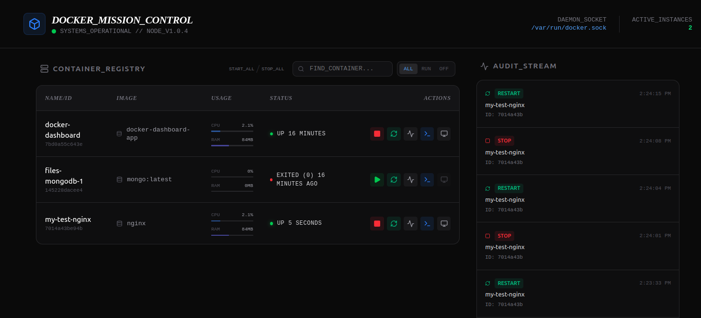

# ContainerSH v1.0

A high-performance, terminal-ready Docker management dashboard with a brutalist, mono-spaced aesthetic. Built with React, Express, Socket.io, and Dockerode.

## 🚀 Key Features

### 🖥️ Interactive Terminal
- **Direct Shell Access**: Open a real-time `/bin/sh` or `/bin/bash` terminal directly into any running container.
- **Xterm.js Integration**: High-fidelity terminal emulation with support for complex commands and window resizing.
- **WebSocket Backend**: Low-latency communication via Socket.io.

### 🕹️ Container Orchestration
- **Full Lifecycle Management**: Start, Stop, and Restart containers with a single click.
- **Bulk Actions**: Power up or shut down your entire infrastructure using the "Start All" and "Stop All" utilities.
- **Real-time Status**: Live polling of container states (Running, Exited, Restarting).

### 🔍 Advanced Registry Tools
- **Filter & Search**: Instantly find containers by Name or Image using the dedicated search bar.
- **Metadata Inspector**: View raw JSON metadata for any container to debug environment variables, networks, or volume mounts.
- **Performance Mockups**: Visual indicators for CPU and RAM utilization for clear infrastructure monitoring.

### 📜 Persistent Audit Stream
- **Action Tracking**: Every action (Start, Stop, Restart) is logged to a MongoDB database.
- **Safety Logs**: Monitor who did what and when, ensuring accountability for server changes.

## 🛠️ Tech Stack
- **Frontend**: React 18, Tailwind CSS, Motion (Animations), Lucide Icons.
- **Terminal**: Xterm.js + Fit Addon.
- **Backend**: Node.js (TypeScript), Express.
- **Real-time**: Socket.io.
- **Infrastructure**: Dockerode (Docker Engine API).
- **Database**: MongoDB (via Mongoose).

## 📦 How to Use

### 1. Prerequisites
- Docker and Docker Compose installed.
- Access to the Docker socket (`/var/run/docker.sock`).

### 2. Local Installation
```bash
# Clone the repository
git clone <repository-url>
cd docker-dashboard

# Install dependencies
npm install

# Build the application
npm run build

# Start the dashboard
npm start
```

### 3. Docker Deployment (Recommended)
```bash
# Build and run using Docker Compose
docker compose up -d --build
```
The dashboard will be available at `http://localhost:3000`.

## ⚠️ Security Note
This dashboard provides direct root access to your containers via the Terminal feature. It is intended for **Internal/VPN use only**. Do not expose this port publicly without a strong Authentication/Reverse Proxy layer (e.g., Nginx with Basic Auth or Authelia).
